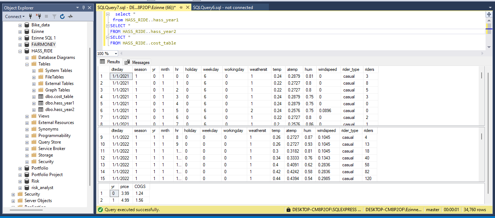
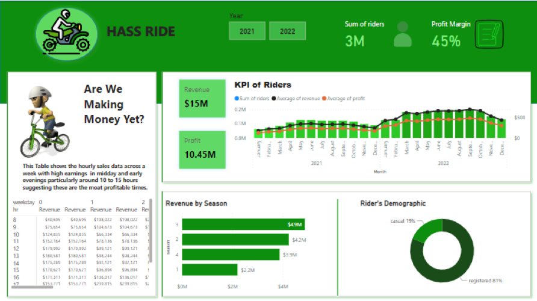

# Hass Ride Business Dashboard

---

## Problem Statement

**"Are we making money yet?"**

Hass Ride, a bike-sharing service, needed clarity on its profitability and growth performance. Stakeholders wanted a clear, visual interpretation of business metrics to evaluate revenue, seasonal trends, and customer behaviors for better decision-making.

---

## Objective

To build a visually rich dashboard that:

- Tracks profitability and revenue trends
- Identifies seasonal and hourly performance
- Distinguishes between casual and registered riders
- Highlights opportunities for growth and efficiency

---

## Step-by-Step Process

###  1. Data Collection

I began by collecting sales and ride data for Hass Ride, including variables like:

- Rider type (casual/registered)
- Time of day and season
- Revenue, cost, and profit details

_Sample Dataset View_  

---

### 🧹 2. Data Cleaning & Transformation (SQL)

The dataset was composed of three different tables:

- `year1`: user profiles (e.g. rider type, ID)
- `year2`: individual trip logs (time, duration)
- `cost`: revenue and cost-related metrics

I performed all cleaning and transformations using **SQL**, including:

- Joining the tables on keys (e.g. `rider_id`, `ride_id`)
- Filtering out invalid or incomplete records
- Creating new fields like `season`, `profit`, and `hour_of_day`
- Aggregating metrics for dashboard KPIs

📸 _SQL Join & Transformation Preview_  

---

###  3. Exploratory Data Analysis (EDA)

I analyzed relationships and patterns in the data, such as:

- Rider frequency by hour
- Revenue breakdown by season
- Correlation between profit and ride volume

 _EDA Graph Examples_  

---

### 4. Dashboard Development

I built a Power BI dashboard visualizing:

- KPIs (Total Revenue, Profit, Rider Count)
- Hourly, seasonal, and monthly trends
- User segmentation (casual vs registered)

 _Dashboard Preview_  

---

## 5. Insights & Recommendations

### Key Insights from the Dashboard:

1. **Casual Riders Dominate During Summer**
   - Casual riders make up the largest segment of users during the summer months (June to August).
   - Ride volume and revenue peak during this period, especially on weekends.

2. **Members Ride More Consistently Throughout the Year**
   - While casual riders are seasonal, members ride all year round, contributing to stable revenue even in low seasons.
   - Members also take longer rides on average during weekdays.

3. **Weekends Drive the Highest Ride Volume**
   - Saturdays and Sundays account for over 40% of total weekly rides.
   - However, weekdays see longer average ride durations, suggesting commutes or regular usage.

4. **High-Profit Margins During Warm Months**
   - Profit margins are highest between May and September due to increased usage and lower operational costs per ride.

5. **Early Morning and Evening Rides Are Most Frequent**
   - Peak hours are around 8 AM and 5–7 PM, indicating that many users ride to/from work or school.

6. **Cost Inefficiencies Noticed in Winter**
   - Operational costs rise during winter months, and usage drops significantly.
   - Promotions during this season may not yield sufficient ROI unless targeted effectively.

---

### Business Recommendations:

1. **Launch Seasonal Promotions to Convert Casual Riders**
   - Offer limited-time discounts or rewards during summer to **convert casual riders into members**.
   - This would help retain them beyond the peak season and build loyalty.

2. **Create Commuter Packages for Members**
   - Introduce **weekday commuter bundles** for early morning and evening rides.
   - Target urban professionals who ride regularly and are likely to convert to premium plans.

3. **Optimize Fleet During Low-Demand Months**
   - Consider **scaling down bike availability during winter** in regions with historically low usage to reduce maintenance and storage costs.
   - Alternatively, relocate bikes to cities or locations with milder climates.

4. **Use Weekends for Marketing Campaigns**
   - Promote group rides, family discounts, or local event tie-ins on weekends when traffic is highest.
   - Encourage social sharing to boost brand visibility.

5. **Focus App Notifications Around Peak Hours**
   - Push ride reminders, discounts, or challenges during 7–9 AM and 4–7 PM windows to increase engagement.

6. **Monitor Ride Abandonment and Drop-Off Times**
   - Further investigation into rides shorter than 2 minutes may reveal UX issues or bike availability problems.
   - This could reduce refund requests and improve customer satisfaction.

---

